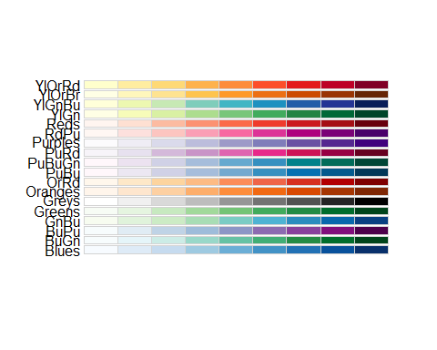

Redraw a Graphic Chart for PWD Analysis Results
================
Curtis C. Bohlen, Casco Bay Estuary Partnership
12/19/2020

-   [Introduction](#introduction)
-   [Load Libraries](#load-libraries)
-   [Folder References](#folder-references)
-   [Load PWD Water Quality Trend
    Data](#load-pwd-water-quality-trend-data)
-   [Create “Long” Data for Plotting](#create-long-data-for-plotting)
-   [Create Candidate Color Schemes](#create-candidate-color-schemes)
-   [Initial Graphic](#initial-graphic)
-   [Revised Version with Totals
    Column](#revised-version-with-totals-column)
    -   [Modify the Long Form Data](#modify-the-long-form-data)
    -   [Revised Color Palette](#revised-color-palette)
    -   [Coding the Revised Graphic](#coding-the-revised-graphic)
-   [Revised (Horizontal) Graphic](#revised-horizontal-graphic)


# Introduction

In this notebook, we redraw graphics developed by PWD, principally so
that colors and fonts match other SoCB report graphics.

# Load Libraries

``` r
library(tidyverse)
#> Warning: package 'tidyverse' was built under R version 4.0.5
#> -- Attaching packages --------------------------------------- tidyverse 1.3.1 --
#> v ggplot2 3.3.5     v purrr   0.3.4
#> v tibble  3.1.4     v dplyr   1.0.7
#> v tidyr   1.1.3     v stringr 1.4.0
#> v readr   2.0.1     v forcats 0.5.1
#> Warning: package 'ggplot2' was built under R version 4.0.5
#> Warning: package 'tibble' was built under R version 4.0.5
#> Warning: package 'tidyr' was built under R version 4.0.5
#> Warning: package 'readr' was built under R version 4.0.5
#> Warning: package 'dplyr' was built under R version 4.0.5
#> Warning: package 'forcats' was built under R version 4.0.5
#> -- Conflicts ------------------------------------------ tidyverse_conflicts() --
#> x dplyr::filter() masks stats::filter()
#> x dplyr::lag()    masks stats::lag()
library(readxl)
#library(readr)

library(CBEPgraphics)
load_cbep_fonts()
theme_set(theme_cbep())

library(RColorBrewer)
display.brewer.all(n=9, type="seq", exact.n=TRUE, colorblindFriendly = TRUE)
```



# Folder References

``` r
sibfldnm <- 'Data'
parent <- dirname(getwd())
sibling <- file.path(parent,sibfldnm)

dir.create(file.path(getwd(), 'figures'), showWarnings = FALSE)
```

# Load PWD Water Quality Trend Data

We download final results from the source Excel file only. We preform no
reanalysis of results. The final results are available in the Excel File
in the “Final Fact Sheet Scores” worksheet.

Note that PWD estimated the “Total” for lakes with insufficient data by
replacing the missing data with a value of THREE.

``` r
fn <- 'Sebago Lake Subwatersheds Summary of Analyses through 2017.xlsx'
sel_sheet <- "Final Fact Sheet Scores"
fpath <- file.path(sibling, fn)

pwd_data <- read_excel(fpath, sheet = sel_sheet,
                       range = 'a1:h26', na = c('ID')) %>%
  select(-...7) %>%
  rename(MIDAS = `MIDAS #`,
         Lake = `Lake Name` ) %>%
  mutate(Lake = fct_reorder(Lake, `Total Score`))
#> New names:
#> * `` -> ...7
```

# Create “Long” Data for Plotting

``` r
pwd_long <- pwd_data %>%
  pivot_longer(cols = 3:6,
               names_to = 'Column',
               values_to = 'Value') %>%
  mutate(Column = factor(Column, levels = c('Existing WQ Score',
                                             'WQ Trend Score',
                                             'Existing Land Cover Score',
                                             'Land Cover Trend Score'),
                         labels = c('Existing WQ',
                                             'WQ Trend',
                                             'Existing Land Cover',
                                             'Land Cover Trend')),
         Value = factor(Value,  levels = c(1:5, 'ID'), exclude = NULL)) %>%
  mutate(Value = replace_na(Value, 'ID'))
```

# Create Candidate Color Schemes

``` r
mycolors = scales::seq_gradient_pal(low = cbep_colors2()[2],
                                    high = cbep_colors2()[4])(seq(0,1,length.out = 5))
mycolors[6] <- cbep_colors2()[1]

altcolors <- brewer.pal(9, "GnBu")[3:7] 
altcolors[6] <- cbep_colors2()[1]
```

# Initial Graphic

``` r
plt <- ggplot(pwd_long, aes(Column, Lake)) +
  geom_raster(aes(fill = Value))  +
  geom_text(aes(label = Value, color = Value)) +
  
  scale_color_manual(values = c(rep('black',5),cbep_colors2()[1])) +
 
  scale_x_discrete(position = "top") +

  ylab('') +
  xlab('') +
    
  coord_fixed(0.75) +
  theme_cbep(base_size = 12) +
  theme(legend.position = 'none') +
  theme(axis.text.x = element_text(angle = 270, hjust = 1))
```

``` r
plt +
  scale_fill_manual(values = cbep_colors2()[6:1], name = '')
```


``` r
plt +
  scale_fill_manual(values = mycolors) 
```


``` r
plt +
  scale_fill_manual(values =altcolors)
```


``` r
ggsave('figures/redraw_PWD_table.pdf', device=cairo_pdf, width = 4, height = 7)
```

# Revised Version with Totals Column

We need to show the totals column, which needs a different color scheme.
We would also like to be able to add an annotation marker to totals
calculated with partial data.

## Modify the Long Form Data

``` r
pwd_long_totals <- pwd_data %>%
  mutate(has_na = is.na(`WQ Trend Score`) | is.na(`Land Cover Trend Score`)) %>%
  pivot_longer(cols = 3:7,
               names_to = 'Column',
               values_to = 'Value') %>%
  mutate(Column = factor(Column, levels = c('Existing WQ Score',
                                             'WQ Trend Score',
                                             'Existing Land Cover Score',
                                             'Land Cover Trend Score',
                                             'Total Score'),
                         labels = c('Existing WQ',
                                    'WQ Trend',
                                    'Existing Land Cover',
                                    'Land Cover Trend',
                                    'Total Score'))) %>%
  
  # We need a color scheme that identifies BOTH the Totals values and the 
  # "Insufficient Data" values, so we can handle them separately 
  mutate(color_scheme = factor(Value),
         color_scheme = fct_collapse(color_scheme, Total = as.character(9:18)),
         color_scheme = factor(color_scheme, levels = c("1", "2", "3", "4", "5",
                                                        "Total", "ID")),
         color_scheme = replace_na(color_scheme, 'ID')) %>%
  
  # Finally, we add asterisks to some "total" values, in case we want them
  mutate(Value = as.character(Value),
         value_star = if_else(Column == 'Total Score' & has_na,
                         paste0(Value, '*'),
                         Value))
```

``` r
levels(pwd_long_totals$color_scheme)
#> [1] "1"     "2"     "3"     "4"     "5"     "Total" "ID"
```

## Revised Color Palette

``` r
altcolors_2 <- brewer.pal(9, "GnBu")[3:7] 
altcolors_2[6] <- 'lightyellow2'
altcolors_2[7] <- cbep_colors2()[1]
```

## Coding the Revised Graphic

We continue to use text colors based on `color_scheme`, so we can hide
the “ID” label if we choose.

``` r
plt2 <- ggplot(pwd_long_totals, aes(Column, Lake)) +
  geom_raster(aes(fill = color_scheme))  +
  geom_text(aes(label = Value, color = Value)) +
  
  scale_color_manual(values = c(rep('black', length(pwd_long_totals$color_scheme)-1),
                                cbep_colors2()[1])) +
 
  scale_x_discrete(position = "top") +

  ylab('') +
  xlab('') +
    
  coord_fixed(0.75) +
  theme_cbep(base_size = 12) +
  theme(legend.position = 'none') +
  theme(axis.text.x = element_text(angle = 270, hjust = 1))
```

``` r
plt2 +
  scale_fill_manual(values = altcolors_2)
#> Warning: Removed 7 rows containing missing values (geom_text).
```


``` r
ggsave('figures/redraw_PWD_table_totals.pdf', device=cairo_pdf, width = 4, height = 7)
#> Warning: Removed 7 rows containing missing values (geom_text).
```

# Revised (Horizontal) Graphic

``` r
# reorder factors so the totals appear on the bottom
pwd_long_totals_2 <- pwd_long_totals %>%
  mutate(Column = factor(Column, levels = c( 'Total Score',
                                             'Existing WQ',
                                             'WQ Trend',
                                             'Existing Land Cover',
                                             'Land Cover Trend')))

plt3 <- ggplot(pwd_long_totals_2, aes(Lake, Column)) +
  geom_raster(aes(fill = color_scheme))  +
  geom_text(aes(label = Value, color = Value)) +
  
  # If you want to show the "ID" label on boxes where there was 
  # insufficient data, change the second color here.
  scale_color_manual(values = c(rep('black', length(pwd_long_totals$color_scheme)-1),
                                cbep_colors2()[1])) +
  ylab('') +
  xlab('') +
    
  coord_fixed(.75) +
  theme_cbep(base_size = 12) +
  theme(legend.position = 'none') +
  theme(axis.text.x = element_text(angle = -45, hjust = 1, size = 8)) +
 #theme(plot.margin = unit(c(.5,4,.5,.5), 'lines')) +
  scale_x_discrete(position = "top")
```

``` r
plt3 +
  scale_fill_manual(values = altcolors_2)
#> Warning: Removed 7 rows containing missing values (geom_text).
```


``` r
ggsave('figures/redraw_PWD_table_horizontal.pdf', device=cairo_pdf, width = 7, height = 4)
#> Warning: Removed 7 rows containing missing values (geom_text).
```
